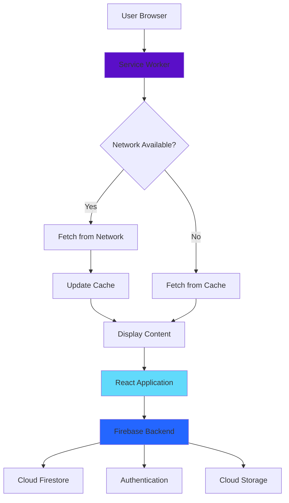
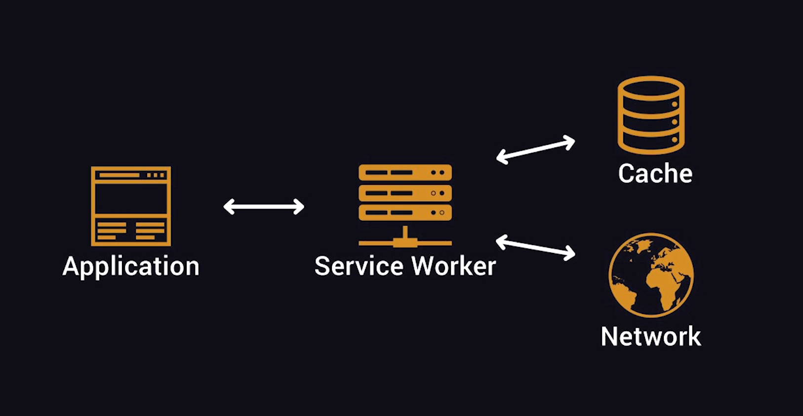

# Memento - Progressive Web Application


A modern Progressive Web Application built with React and Firebase, designed to provide a seamless offline-first experience across all devices.

## 🚀 Tech Stack


## 📱 Progressive Web App Architecture



## 📱 Progressive Web App Architecture Diagram



## ✨ Features

- 🔄 **Offline Support**: Works seamlessly without internet connection
- 📲 **Installable**: Add to home screen on mobile devices
- ⚡ **Fast Loading**: Optimized with service workers and caching
- 🔐 **Secure**: Firebase Authentication integration
- 📊 **Real-time Data**: Cloud Firestore for live updates
- 🎨 **Responsive Design**: Works on all screen sizes
- 🔔 **Push Notifications**: Stay updated with important events

## 🛠️ Installation

### Prerequisites

- Node.js (v14 or higher)
- npm or yarn
- Firebase account

### Setup

1. Clone the repository:

```bash
git clone https://github.com/yourusername/memento.git
cd memento
```

2. Install dependencies:

```bash
npm install
```

3. Configure Firebase:
   - Create a `.env` file in the root directory
   - Add your Firebase configuration:

```env
REACT_APP_FIREBASE_API_KEY=your_api_key
REACT_APP_FIREBASE_AUTH_DOMAIN=your_auth_domain
REACT_APP_FIREBASE_PROJECT_ID=your_project_id
REACT_APP_FIREBASE_STORAGE_BUCKET=your_storage_bucket
REACT_APP_FIREBASE_MESSAGING_SENDER_ID=your_sender_id
REACT_APP_FIREBASE_APP_ID=your_app_id
```

4. Start the development server:

```bash
npm start
```

## 🚀 Deployment

### Build for Production

```bash
npm run build
```

### Deploy with Serve

```bash
npm install -g serve
serve -s build
```

### Deploy to Firebase Hosting

```bash
npm install -g firebase-tools
firebase login
firebase init
firebase deploy
```

## 📦 Project Structure

```
memento/
├── public/
│   ├── index.html
│   ├── manifest.json
│   └── service-worker.js
├── src/
│   ├── components/
│   ├── pages/
│   ├── services/
│   ├── utils/
│   ├── App.js
│   └── index.js
├── webpack.config.js
├── package.json
└── README.md
```

## 🔧 Configuration

### Webpack Configuration

The project uses Webpack for bundling and optimization. Key features:

- Code splitting
- Tree shaking
- Asset optimization
- Hot module replacement (HMR)

### Service Worker

The service worker enables:

- Offline functionality
- Background sync
- Push notifications
- Resource caching

## 🤝 Contributing

Contributions are welcome! Please follow these steps:

1. Fork the repository
2. Create a feature branch (`git checkout -b feature/AmazingFeature`)
3. Commit your changes (`git commit -m 'Add some AmazingFeature'`)
4. Push to the branch (`git push origin feature/AmazingFeature`)
5. Open a Pull Request

## 📄 License

This project is licensed under the MIT License - see the [LICENSE](LICENSE) file for details.

## 🙏 Acknowledgments

- React team for the amazing framework
- Firebase for backend services
- The PWA community for best practices and tools

## 📞 Contact

Project Link: [https://memento-fed12.web.app/](https://memento-fed12.web.app/)

---

Made with ❤️ using React and Firebase
